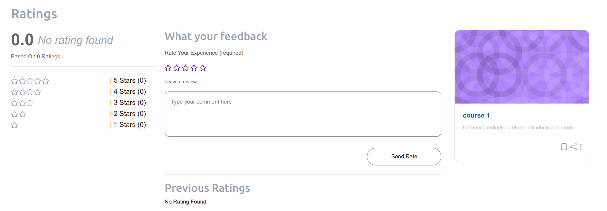

# Moodle Course Rating Helper

The plugin contains a link to a separate form page to give a rating and displays the current aggregate of all user ratings including the number of people who have made ratings.

## Rating Form


## Rating Display


Each user can rate a course only once. If they visit the ratings form again, a message is displayed all courses and hide form displays the rating they gave.

## Features
- Display course wise Rating
- User can make a comment
- Average rating display
- smooth loading
- Easy to istall
- Access from anywhere with additional url


## Configuration

You can install this plugin from [Moodle plugins directory](https://moodle.org/plugins) or can download from [Github](https://github.com/eLearning-BS23/moodle-local_rating_helper).

You can download zip file and install or you can put file under local as rating_helper

## Plugin Settings
- Just install plugin add a url in your theme something like -
```
  $CFG->wwwroot . '/local/rating_helper/index.php?course_id={your_course_id}'
```
## Access Page


- That's it. and you are done!
- Enjoy the plugin!


